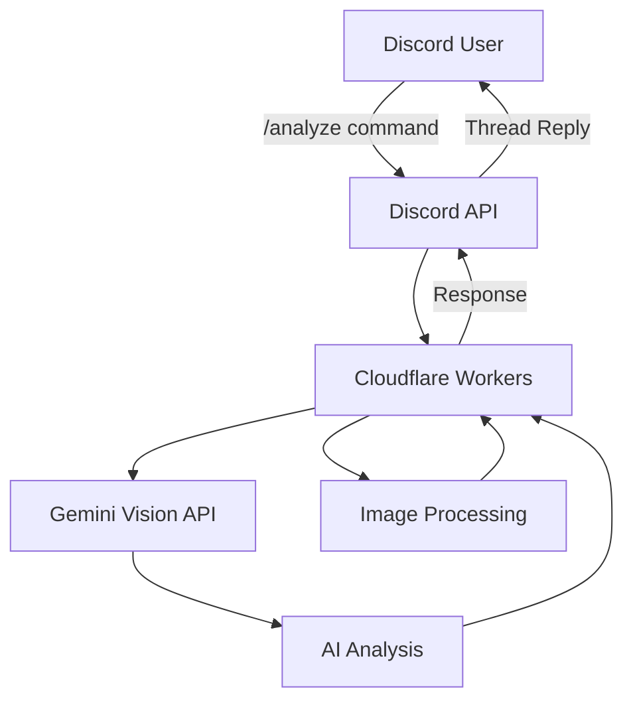

# アーキテクチャ

Discord Farmbotのシステム構成と技術的な設計について詳しく説明します。

## 🏗️ システム概要

Discord Farmbotは、サーバーレスアーキテクチャを採用したAI搭載の画像解析Botです。



## 🔧 技術スタック

### コア技術
- **Runtime**: Cloudflare Workers (V8 JavaScript Engine)
- **Language**: JavaScript (ES2022)
- **AI API**: Google Gemini Vision API
- **Platform**: Discord API v10

### 開発・デプロイツール
- **Package Manager**: npm
- **Bundler**: Wrangler CLI
- **Version Control**: Git
- **CI/CD**: GitHub Actions

### ドキュメント
- **Documentation**: VuePress 2.x
- **Hosting**: GitHub Pages

## 📁 プロジェクト構造

```
discord-farmbot/
├── farmbot.js              # メインWorkerファイル
├── package.json            # 依存関係・スクリプト定義
├── wrangler.toml           # Cloudflare Workers設定
├── .dev.vars.example       # 環境変数テンプレート
├── .gitignore             # Git除外設定
├── LICENSE                # ライセンス
├── README.md              # プロジェクト概要
├── CHANGELOG.md           # 変更履歴
│
├── scripts/               # ユーティリティスクリプト
│   ├── deploy-secrets.sh  # 環境変数デプロイ
│   └── register-commands.js # Discord コマンド登録
│
├── tests/                 # テストファイル
│   ├── test-env.js        # 環境変数テスト
│   ├── test-gemini-api.js # Gemini APIテスト
│   ├── test-bot.js        # Bot機能テスト
│   └── test-endpoints.js  # エンドポイントテスト
│
├── docs/                  # ドキュメント
│   ├── .vuepress/         # VuePress設定
│   ├── user-guide/        # ユーザーガイド
│   ├── developer-guide/   # 開発者ガイド
│   └── deployment/        # デプロイガイド
│
└── .github/               # GitHub設定
    └── workflows/         # GitHub Actions
        └── deploy-docs.yml # ドキュメントデプロイ
```

## 🔄 データフロー

### 1. コマンド受信フロー

```javascript
// 1. Discord からのリクエスト受信
export default {
  async fetch(request, env) {
    // 2. リクエスト検証
    const isValid = await verifyDiscordRequest(request, env);
    if (!isValid) return new Response('Unauthorized', { status: 401 });
    
    // 3. インタラクション処理
    const interaction = await request.json();
    return await handleInteraction(interaction, env);
  }
}
```

### 2. 画像解析フロー

```javascript
// 1. 画像データ取得
const imageUrl = interaction.data.resolved.attachments[attachmentId].url;
const imageResponse = await fetch(imageUrl);
const imageBuffer = await imageResponse.arrayBuffer();

// 2. 画像検証
if (imageBuffer.byteLength > MAX_FILE_SIZE) {
  throw new Error('Image too large');
}

// 3. Base64エンコード
const base64Image = arrayBufferToBase64(imageBuffer);

// 4. Gemini API呼び出し
const analysisResult = await analyzeWithGemini(base64Image, env);

// 5. 結果フォーマット
const formattedResult = formatAnalysisResult(analysisResult);

// 6. Discord応答
await sendFollowupMessage(interaction, formattedResult, env);
```

## 🏛️ アーキテクチャパターン

### 1. サーバーレスアーキテクチャ

**利点**:
- ✅ **自動スケーリング**: 負荷に応じて自動拡張
- ✅ **コスト効率**: 使用量に応じた課金
- ✅ **メンテナンス不要**: インフラ管理が不要
- ✅ **高可用性**: Cloudflareの分散ネットワーク

**制約**:
- ⏱️ **実行時間制限**: 30秒のタイムアウト
- 💾 **メモリ制限**: 128MB RAM
- 🔄 **ステートレス**: 永続化ストレージなし

### 2. イベント駆動アーキテクチャ

```javascript
// Discord Interaction → Event Handler → Response
const eventHandlers = {
  APPLICATION_COMMAND: handleSlashCommand,
  MESSAGE_COMPONENT: handleButtonClick,
  APPLICATION_COMMAND_AUTOCOMPLETE: handleAutocomplete
};

async function handleInteraction(interaction, env) {
  const handler = eventHandlers[interaction.type];
  if (handler) {
    return await handler(interaction, env);
  }
  return new Response('Unknown interaction type', { status: 400 });
}
```

### 3. 関数型プログラミング

```javascript
// 純粋関数による画像処理パイプライン
const processImage = pipe(
  validateImageSize,
  convertToBase64,
  enhanceImageQuality,
  extractMetadata
);

// 関数合成による解析パイプライン
const analyzeImage = compose(
  formatResult,
  parseGeminiResponse,
  callGeminiAPI,
  preparePrompt
);
```

## 🔐 セキュリティアーキテクチャ

### 1. 認証・認可

```javascript
// Discord リクエスト検証
async function verifyDiscordRequest(request, env) {
  const signature = request.headers.get('X-Signature-Ed25519');
  const timestamp = request.headers.get('X-Signature-Timestamp');
  const body = await request.text();
  
  return await verifySignature(
    env.DISCORD_PUBLIC_KEY,
    signature,
    timestamp,
    body
  );
}
```

### 2. 環境変数管理

```toml
# wrangler.toml
[env.production]
vars = { ENVIRONMENT = "production" }

# Secrets (暗号化保存)
# DISCORD_PUBLIC_KEY
# DISCORD_BOT_TOKEN
# GEMINI_API_KEY
```

### 3. レート制限

```javascript
// API呼び出し制限
const rateLimiter = {
  gemini: new RateLimiter(60, 60000), // 60 requests per minute
  discord: new RateLimiter(50, 1000)  // 50 requests per second
};
```

## 📊 パフォーマンス設計

### 1. 画像処理最適化

```javascript
// 画像サイズ制限
const MAX_FILE_SIZE = 500 * 1024; // 500KB

// 画像形式検証
const SUPPORTED_FORMATS = ['image/png', 'image/jpeg', 'image/webp'];

// Base64エンコード最適化
function arrayBufferToBase64(buffer) {
  const bytes = new Uint8Array(buffer);
  const len = bytes.byteLength;
  let binary = '';
  
  // チャンク処理で大容量画像に対応
  const chunkSize = 8192;
  for (let i = 0; i < len; i += chunkSize) {
    const chunk = bytes.subarray(i, i + chunkSize);
    binary += String.fromCharCode.apply(null, chunk);
  }
  
  return btoa(binary);
}
```

### 2. API最適化

```javascript
// Gemini API プロンプト最適化
const ANALYSIS_PROMPT = `
農作物の画像を専門的に解析してください。
以下の形式で回答してください：

🌱 作物: [植物名]
📅 成長段階: [段階]
🏥 健康状態: [状態]
💡 推奨アクション: [具体的なアドバイス]
`;

// レスポンス時間最適化
const GEMINI_CONFIG = {
  temperature: 0.1,        // 一貫性重視
  maxOutputTokens: 1000,   // 出力制限
  topP: 0.8,              // 品質重視
  topK: 10                // 候補制限
};
```

### 3. キャッシュ戦略

```javascript
// 将来実装予定: KVストレージによるキャッシュ
async function getCachedAnalysis(imageHash, env) {
  const cached = await env.ANALYSIS_CACHE.get(imageHash);
  if (cached) {
    return JSON.parse(cached);
  }
  return null;
}

async function setCachedAnalysis(imageHash, result, env) {
  await env.ANALYSIS_CACHE.put(
    imageHash, 
    JSON.stringify(result),
    { expirationTtl: 86400 } // 24時間キャッシュ
  );
}
```

## 🔄 状態管理

### 1. ステートレス設計

```javascript
// 各リクエストは独立して処理
// セッション状態は Discord Interaction Token で管理
async function handleSlashCommand(interaction, env) {
  // 初期応答（3秒以内必須）
  await sendInitialResponse(interaction);
  
  // 非同期処理
  await processImageAnalysis(interaction, env);
  
  // フォローアップ応答
  await sendFollowupMessage(interaction, result, env);
}
```

### 2. エラー状態管理

```javascript
// エラーハンドリング階層
const errorHandlers = {
  ValidationError: (error) => ({
    content: `❌ ${error.message}`,
    ephemeral: true
  }),
  
  APIError: (error) => ({
    content: '🔧 一時的な問題が発生しました。しばらく後に再試行してください。',
    ephemeral: true
  }),
  
  UnknownError: (error) => ({
    content: '⚠️ 予期しないエラーが発生しました。サポートにお問い合わせください。',
    ephemeral: true
  })
};
```

## 🧪 テスト戦略

### 1. テスト階層

```javascript
// 単体テスト
describe('Image Processing', () => {
  test('validates image size', () => {
    expect(validateImageSize(largeImage)).toThrow('Image too large');
  });
});

// 統合テスト
describe('Gemini API Integration', () => {
  test('analyzes crop image', async () => {
    const result = await analyzeWithGemini(testImage, mockEnv);
    expect(result).toContain('トマト');
  });
});

// E2Eテスト
describe('Discord Bot E2E', () => {
  test('handles analyze command', async () => {
    const response = await handleInteraction(mockInteraction, env);
    expect(response.status).toBe(200);
  });
});
```

### 2. モック戦略

```javascript
// API モック
const mockGeminiAPI = {
  analyze: jest.fn().mockResolvedValue({
    crop: 'トマト',
    stage: '開花期',
    health: '良好'
  })
};

// 環境変数モック
const mockEnv = {
  DISCORD_PUBLIC_KEY: 'test-key',
  DISCORD_BOT_TOKEN: 'test-token',
  GEMINI_API_KEY: 'test-api-key'
};
```

## 📈 監視・ログ

### 1. ログ戦略

```javascript
// 構造化ログ
function logAnalysis(interaction, result, duration) {
  console.log(JSON.stringify({
    timestamp: new Date().toISOString(),
    event: 'image_analysis',
    user_id: interaction.user.id,
    guild_id: interaction.guild_id,
    crop_detected: result.crop,
    confidence: result.confidence,
    duration_ms: duration,
    image_size: result.imageSize
  }));
}
```

### 2. メトリクス

```javascript
// パフォーマンスメトリクス
const metrics = {
  analysisCount: 0,
  averageResponseTime: 0,
  errorRate: 0,
  apiUsage: {
    gemini: 0,
    discord: 0
  }
};
```

## 🚀 スケーラビリティ

### 1. 水平スケーリング

- **Cloudflare Workers**: 自動的に世界中のエッジで実行
- **負荷分散**: Cloudflareのグローバルネットワーク
- **地理的分散**: ユーザーに最も近いエッジで処理

### 2. 垂直スケーリング

```javascript
// リソース使用量最適化
const optimizations = {
  imageProcessing: 'WebAssembly実装検討',
  memoryUsage: 'ストリーミング処理',
  cpuUsage: 'Worker Threads活用'
};
```

## 🔮 将来の拡張計画

### 1. 機能拡張

- **マルチモーダル解析**: 音声・動画対応
- **リアルタイム監視**: Cron Triggersによる定期解析
- **データ蓄積**: Durable Objectsによる状態管理

### 2. アーキテクチャ進化

```javascript
// マイクロサービス化
const services = {
  imageAnalysis: 'Cloudflare Workers',
  dataStorage: 'Cloudflare D1',
  fileStorage: 'Cloudflare R2',
  cache: 'Cloudflare KV',
  queue: 'Cloudflare Queues'
};
```

---

::: tip 💡 アーキテクチャの特徴
Discord Farmbotは、**シンプルさ**と**スケーラビリティ**を両立させたモダンなサーバーレスアーキテクチャを採用しています。単一ファイル構成でありながら、エンタープライズレベルの可用性と性能を実現しています。
:::

::: warning ⚠️ 制約事項
Cloudflare Workersの制約（実行時間30秒、メモリ128MB）を考慮した設計となっています。大容量画像や複雑な処理には別のアプローチが必要になる場合があります。
:::